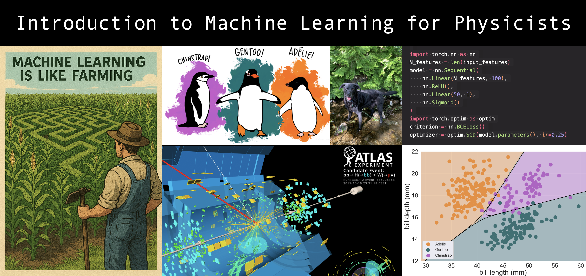

# Introduction to Machine Learning for Physicists

This repository is designed as an entry point for those looking to learn about machine learning in the physical sciences. 
The material in this repository was originally prepared for the EruM-Data-Hub 2025 Deep Learning School "Basic Concepts', which took place in Aachen, Germany in May 2025. The lectures and exercises were delivered by Maximilian Horzela (University of Gottingen), 

## Session Goals
* Give context to the development of deep learning, and its importance in modern physical sciences.
* Build a foundation for deep learning by introducing classical ML techniques.
* Provide an introduction to the PyTorch ML framework.
* Explain the basis building blocks of deep neural networks, and their construction in PyTorch.
* Introduce canonical sueprvised learning tasks using the penguins dataset and ATLAS Experiment OpenData.

## Interactive Elements
1. Practice using `PyTorch` tensors
2. Simple linear regression
3. Binary classification through logistic regression
4. Applying neural networks to tasks 2 and 3
5. Building a small DNN to identify the Higgs boson in LHC data!

## References
The tutorials herein make use of ATLAS OpenData, namely the _ATLAS 13 TeV samples collection with at least two leptons (electron or muon), for 2020 Open Data release_ ([10.7483/OPENDATA.ATLAS.GQ1W.I9VI](10.7483/OPENDATA.ATLAS.GQ1W.I9VI)). Thank you to the ATLAS Collaboration for providing 

